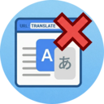

<div align="center">
  

  # Disable Google Auto Translate — Firefox Addon
</div
 

 
Firefox extension that automatically redirects Google Translate URLs (`translate.goog`) back to the original site, without translation.
 
## What it does
 
When you open a Google-translated link like:
```
https://www-oreilly-com.translate.goog/library/view/...?_x_tr_sl=en&_x_tr_tl=es
```
The extension intercepts it and takes you directly to:
```
https://www.oreilly.com/library/view/...
```
 
## Installation
 
1. Open Firefox and go to: https://addons.mozilla.org/en-US/firefox/addon/skip-translate-pages/
2. Click **"Add to Firefox"**

## Files
 
```
├── manifest.json     # Extension configuration
└── background.js     # Redirect logic
```
 
## Required permissions
 
- `webRequest` + `webRequestBlocking` — to intercept and redirect requests
- `*://*.translate.goog/*` — only active on Google Translate URLs
## Compatibility
 
Firefox with Manifest V3. Not compatible with Chrome (requires `declarativeNetRequest`).
 
## Status
 
This is the first working version. The extension is in early development and new features, fixes, and improvements are on the way.
